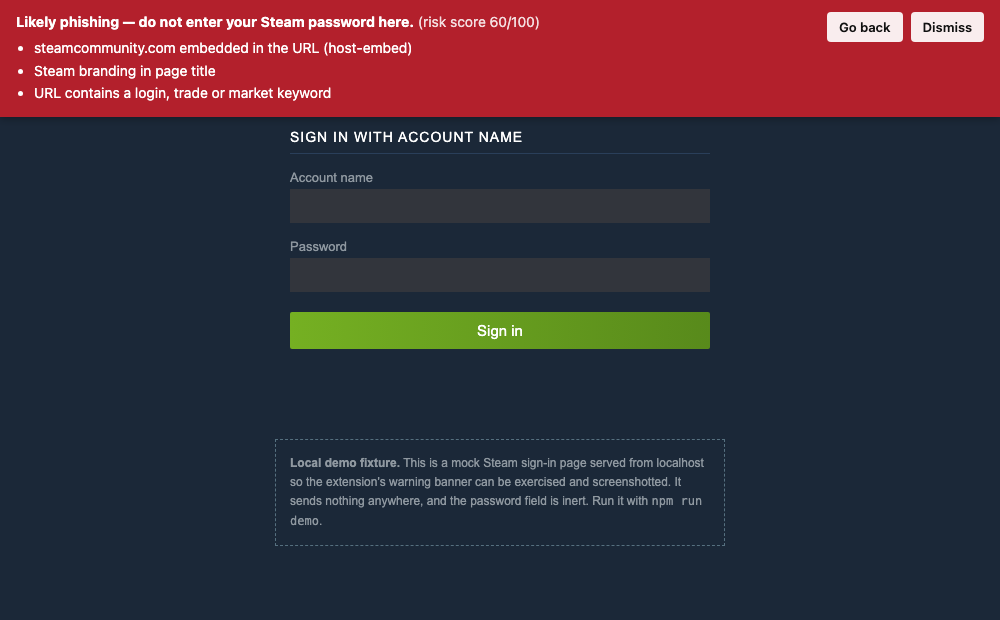

# Steam Phishing Detector

[](https://github.com/OmereKurt/steam-phishing-detector/actions/workflows/ci.yml)

A Chrome extension that scores Steam credential-phishing pages and warns before a
password is typed — plus the corpus, the DNS survey, the million-domain benchmark
and the live-feed evaluation that say how well it actually works.

**Scored against 1,000,000 real domains, it warns on 7 — one in 142,857.** Three of
those seven are genuine Steam brand squats that belong in the list. Every number
here is reproducible with a single npm command.

**Scored against 73,250 live phishing URLs, it catches five of the seven aimed**
**at Steam, and warns on six URLs in total — every one of them genuine.** It used
to catch two of seven. Closing that gap meant fixing three defects the live feeds
exposed, each one costing nothing in the million-domain benchmark; the
measurements are below, including the versions that were measured and thrown
away.



## Why this repository exists

Most student phishing-detector projects claim they detect phishing. Very few can
tell you how often they are right, or what they miss, or what a false positive
costs. The scoring engine here is not the interesting part — the corpus and the
measurement are. The engine is how you get something to measure.

## How detection works

`src/scoring.js` exposes one pure function:

```javascript
score(url, pageSignals) -> { score, verdict, reasons }
```

No Chrome APIs, no DOM, no network. That is what lets it be run over a labelled
corpus in Node instead of only inside a browser.

Eight weighted signals accumulate, rather than a chain of ANDed conditions:

| Signal | Weight | Catches |
|---|---:|---|
| Damerau-Levenshtein ≤ 2 from an official domain, or ≤ 3 sharing six leading characters | 40 | `steamcommnuity.com`, `stearnpowered.com`, `steamcomnunnlty.com` |
| Homoglyph substitution | 35 | Cyrillic `е`, `rn` for `m`, `0` for `o` |
| Official domain embedded in host, label, path or query | 35 | `steamcommunity.com.trade-skins.tk` |
| Registrable label Valve publishes, on a suffix it does not use | 30 | `steamgames.net`, `steamstatic.io` |
| Punycode / IDN label | 30 | `xn--stampowered-pkj.com` |
| Steam branding in title or image alt text | 15 | Page dressed as Steam |
| Free-registration TLD | 10 | `.tk .ml .ga .cf .gq` |
| Login / trade / market keyword in the URL | 10 | `/login`, `/tradeoffer/` |

Then a gate, applied as a multiplier rather than a signal:

```javascript
const hasCredentialField = !!document.querySelector('input[type="password"]');
```

No password field halves the score. A Steam fan wiki has branding, a `trade`
keyword and no way to steal a credential — so it stays silent. This is the single
biggest false-positive reduction in the design.

Verdicts: **≥ 60** red block banner · **35–59** amber caution · **< 35** silent.
Official Valve domains are allowlisted and short-circuit to zero before any signal
runs.

Full reasoning, and the limitations, in [docs/DESIGN.md](docs/DESIGN.md).

## Measured performance

Four measurements, because they answer different questions and have very
different strengths.

### 1. False positives against a million real domains

The one measurement the scorer was never tuned against, and the only one drawn
entirely from outside this repository.

```
$ npm run benchmark -- top-1m.csv
Scored 1,000,000 real domains in 16.7s.

  Flagged at warn  (>=35): 7  (0.0007%)
  Flagged at block (>=60): 1  (0.0001%)

  1 in 142,857 real domains triggers a warning.

    # 225664   75  block    wsteamcommunity.com      [edit_distance, embedded_official]
    # 327504   40  caution  steamcommunity.rip       [edit_distance]
    # 471601   40  caution  steamcommunity.tips      [edit_distance]
    # 526087   35  caution  steampoweredfamily.com   [embedded_official]
    # 774364   40  caution  cukong88login.xn--6frz82g[punycode, login_keyword]
    # 957047   40  caution  stampcommunity.org       [edit_distance]
    # 977362   40  caution  sealcommunity.org        [edit_distance]
```

Domains come from the [Tranco](https://tranco-list.eu/) top-sites list, ranked by
real traffic. Every flag is printed — nothing hides behind a summary statistic.

Reading them honestly: `wsteamcommunity.com`, `steamcommunity.rip` and
`steamcommunity.tips` are Steam brand squats and the warning is correct.
`steampoweredfamily.com` is a STEM-education site, `stampcommunity.org` belongs to
stamp collectors, `sealcommunity.org` to conservationists, and the punycode one is
unrelated. So the real cost is **four false positives per million domains**, and it
is visible rather than asserted.

Tranco is rebuilt daily, so these counts move. The run above used the list
downloaded on 2026-08-21; an earlier snapshot flagged six rather than seven, the
extra one being `sealcommunity.org`. Re-running the command reproduces whatever
today's list says, which is the point of shipping the command rather than the
number.

### 2. How much of the lookalike surface is actually registered

`src/permutations.js` generates the typosquats an attacker would plausibly buy —
omission, transposition, keyboard slips, bitsquatting, homoglyphs, hyphenation,
TLD swaps, combosquatting. `npm run discover` then asks DNS which of them exist.

```
777 candidates generated from steamcommunity.com and steampowered.com
159 are registered  (20.5%)

  tld-swap 31 · insertion 25 · replacement 24 · omission 20 · repetition 14
  transposition 12 · combosquat 12 · bitsquatting 9 · homoglyph-ascii 6 · ...
```

One in five permutations of the two domains Steam users actually sign in to has
been bought by someone. Results are in [data/lookalikes.json](data/lookalikes.json),
defanged.

**Registration is not malice**, and this is not a detection metric. Some of those
are Valve's own defensive registrations, some are parked, some are unrelated
businesses. The scorer flags 159 of 159, and that number is close to meaningless:
these candidates were produced by the same transformations the scorer measures, so
a domain made by deleting one character is one edit from the original *by
construction*. It is a sanity check that the generator and the scorer share a
definition of "close" — nothing more, and it is labelled that way in the data file.

DNS only. Nothing here ever connected to a discovered domain.

### 3. Precision and recall on the labelled corpus

`test/corpus.json` holds 86 hand-labelled URLs — 38 phishing, 48 benign — covering
typosquats, homoglyphs, punycode, embedded domains, brand-abuse lures, official
Steam pages, legitimate Steam-adjacent sites, and unrelated credential pages. This
is the set CI enforces floors against.

```
| Threshold  | TP | FP | TN | FN | Precision | Recall |   F1  |
|-----------:|---:|---:|---:|---:|----------:|-------:|------:|
|        20  | 37 |  3 | 45 |  1 |     92.5% |  97.4% | 0.949 |
|  35 (warn) | 35 |  0 | 48 |  3 |    100.0% |  92.1% | 0.959 |
| 60 (block) | 24 |  0 | 48 | 14 |    100.0% |  63.2% | 0.774 |
```

`npm run eval:misses` lists every misclassified URL with the signals behind it.

**What it misses.** The three remaining failures are Steam-*themed* lures with no
lookalike domain — `steamwallet-generator.cf`, `steam-community-market.xyz`,
`steamsupport-helpdesk.online`. A domain analyser has nothing to grip on those.
They are in the corpus on purpose: a test set containing only cases you catch
measures nothing.

`steamgames.net` used to be a fourth. It was never really the same class of miss —
it is the exact label Valve publishes, resold under another suffix — and it is now
caught. See below.

**What these numbers are not.** This corpus is hand-written — real attack shapes,
invented hostnames — and 86 URLs is small. It is a regression suite, not evidence
about the wild. The extension has never been deployed to a user. Full limitations
in [docs/DESIGN.md](docs/DESIGN.md#honest-limitations).

### 4. Against live phishing feeds

The corpus above is hand-written. This is the same scorer against hostnames
attackers actually registered, from PhishTank's verified-online feed
(73,250 URLs on 2026-08-24) and the OpenPhish community feed (300 URLs).

```
$ npm run live-eval -- online-valid.csv openphish-feed.txt

  Recall on target="Steam" (13 entries)      warned on 4/13
  Specificity across all 73,250 phishing URLs
    warned  (>= 35): 6  (0.0082%)
    blocked (>= 60): 0
  OpenPhish community feed: 300 URLs, 0 warned.
```

Nothing in that pipeline fetches a URL. Every input is scored as a string.

**Specificity is the good result.** Six warnings across 73,250 live phishing
URLs, and **all six are genuine Steam impersonation** — two of them,
`svteamconmmunity[.]com` and `steamcommunitylog[.]chez[.]com`, PhishTank files
under `Other`, so the scorer labelled them before the feed did. Zero blocks. Zero
hits on 300 OpenPhish URLs. Phishing infrastructure aimed at Allegro, the IRS and
Amazon is a far more adversarial negative set than Tranco's legitimate domains,
and a Steam-specific scorer stays quiet on it.

**Recall is the bad result, and it is worse than the corpus implies.** Start by
discounting the label: 7 of those 13 are not Steam domain phishing at all. Four
are ad-tracker and affiliate redirects, one is `www.google.com` with query
parameters, one is a generic `.html` drop. PhishTank's `target` column is
submitter-supplied and noisy. That leaves six genuine Steam-impersonation
hostnames, plus the one mislabelled `Other`:

| URL | Score | Why |
|---|---:|---|
| `login.steampowered[.]com[.]ru` | 45 | caught — embedded official domain |
| `svteamconmmunity[.]com` | 40 | caught — distance 2 |
| `steamcomunity[.]eu[.]cc` | 40 | caught — label outside the registrable domain |
| `steamcomnunnlty[.]com` | 40 | caught — distance 3, shared opening |
| `steamcomunmitty[.]com` | 40 | caught — distance 3, shared opening |
| `store-steampowereed[.]ru` | 0 | missed — combosquat plus a doubled letter, distance 7 |
| `store.communitystudionsarts[.]shop` | 0 | missed — brand lure, no lookalike domain |

**Five of seven, up from two.** The last three rows were the three defects; the
first two of them are now closed, and the fixes are below. The remaining two are
genuinely hard: one is seven edits out, and the other has no lookalike domain for
a domain analyser to grip.

The corpus still reports 92.1% and real hostnames now give 71%. Both numbers are
honest and they measure different things — the corpus measures the shapes I
thought of, this measures the shapes attackers chose. The gap between them was
the most useful thing in this repository, and it is what produced everything in
the next section.


## What the live feeds exposed

Three defects, and the measured cost of each fix. Every candidate was scored
against the Tranco top million before it was considered, for the same reason as
always: the cost of a change is a false positive rate, not an opinion. The first
version of each fix was rejected, and saying so is the point.

### Defect 1: the suffix stand-in dropped the brand label

`steamcomunity[.]eu[.]cc` scored zero. `registrableDomain` does not know `eu.cc`
is a suffix people register under, so it parsed the registrable domain as `eu.cc`
and the brand as `eu` — and `steamcomunity`, one edit from `steamcommunity`, was
discarded as a subdomain before any signal ran. The 20-entry
`MULTI_PART_SUFFIXES` list is documented as a stand-in for the Public Suffix
List; this is what that shortcut actually cost.

**Rejected: measure every label, unconditionally.** Catches it, and costs one
false positive — `starcommunity.com.au`, an Australian business two edits from
`steamcommunity`.

**Shipped: measure every label, but require a shared opening.** A match found
outside the registrable label is weaker evidence, so it carries the same
six-character prefix requirement as a distance-3 match. `steamcomunity` shares
eight characters with `steamcommunity`; `starcommunity` shares two.

**Cost, measured: zero. The million-domain benchmark is byte-identical.**

A regression surfaced while testing it, and it is the more interesting half.
Scoring *every* label without excluding distance 0 took
`steamcommunity.fandom.com` — a fan wiki — from 0 to 40, because its subdomain is
an exact official brand. An official brand sitting in someone else's hostname is
`embedded_official`'s job, and that signal is weighed differently on purpose. So
the label path now skips distance 0 entirely and only catches misspellings.

**The million-domain benchmark could not have caught this.** Tranco lists
registrable domains and never subdomains, so nothing in a one-million-row sweep
of bare hostnames exercises the case. The 86-URL corpus caught it. A small
hand-written set is not a worse version of a large measured one — it covers
shapes the large one structurally cannot reach.

### Defect 2: real typosquats sit at distance 3

`steamcomnunnlty[.]com` and `steamcomunmitty[.]com` are both exactly three edits
from `steamcommunity`. `MAX_LOOKALIKE_DISTANCE` was 2, so both scored zero. The
threshold was tuned against a corpus whose typosquats I wrote, and I wrote
plausible ones — attackers register uglier strings than that.

**Rejected: raise the threshold to 3.** Catches both, and costs six false
positives in the top million: `telecommunity.com`, `stakecommunity.com`,
`stintcommunity.com`, `sexycommunity.it`, `sexxcommunity.com`, `telapowered.com`.
All real businesses.

**Shipped: distance 3, but only with six shared leading characters.** What
separates the typosquats from the businesses is not the distance, it is where the
edits fall. A typo preserves the start of the word, because that is the part a
reader actually processes. The false positives share only a *suffix* — they are
different words ending in "community", not misspellings of this one.

```
  steamcomnunnlty   distance 3, shared opening 8   ← typosquat
  steamcomunmitty   distance 3, shared opening 8   ← typosquat
  stakecommunity    distance 3, shared opening 2   ← business
  telecommunity     distance 3, shared opening 0   ← business
```

**Cost, measured: zero new warnings and zero lost detections across the top**
**million.** Distance 1 and 2 are unaffected, so `stearnpowered.com` — which
shares only four characters — still fires as it always did.

### Defect 3: a materialised neighbourhood only covers what was enumerated

`steamcommunitiy.com` is **one** edit from `steamcommunity`. The extension scored
it 50. The generated SIEM rules missed it completely, because none of the eleven
techniques in `src/permutations.js` happen to produce that string, and the lookup
can only contain what something generated.

That is the difference between the two consumers of the generator. `discover.js`
wants *plausible* registrations to resolve against DNS. A SIEM lookup wants
*coverage* of the scorer's threshold, or the rule is quietly narrower than the
product. `exhaustiveNeighbourhood()` now enumerates the complete distance-1
space — every insertion, deletion, substitution and transposition — and the
materialiser unions both.

**Cost: the lookup grew from 631 hosts to 2,101, and rule coverage went from**
**77.1% to 80.0% with no new false positives.** Distance 2 stays technique-driven:
the complete distance-2 neighbourhood of a fourteen-character label runs to
hundreds of thousands of strings, which is a lookup nobody wants and a
false-positive surface nobody has measured. That limit is documented rather than
hidden.

### One more, measured three ways and never shipped

Matching each label of an observed hostname against the bare lookalike labels
would catch `steamcomunity[.]eu[.]cc` in the SIEM rules too, not just the
extension. Three versions were measured:

| Version | Result |
|---|---|
| Any label of any materialised host | **226 false positives** in the top million |
| Labels ≥ 8 chars, 1–2 edits from a brand | Clean — 1 hit, correct, but needs exact equality |
| `contains`, the most Sigma can express | Fires on `steamcommunity.fandom.com` |

The first failed because `subdomain-split` emits hosts like `steampower.ed.com`,
whose registrable label is the fragment `ed` — so the set contained `ed`, `d` and
`red`, and matched `ed.gov`, `red.es` and `d.hu`. The third failed because that
fan wiki contains the distance-1 label `steamcommunit`.

The middle version works, and Sigma still cannot express it: there is no operator
that splits a hostname into labels. Shipping the exact form in KQL and XQL but
not Sigma would leave the four artefacts disagreeing about what the rule is.
So the suffix-independent class stays uncovered by the rules, and is listed with
page branding and the credential gate as something the extension catches and a
log-based rule cannot.

## The signal that never fired

Building the SIEM rules surfaced a defect worse than either of the two above,
because it was in the signal the front page advertises.

`new URL()` applies IDNA before `score()` ever runs. A hostname typed with a
Cyrillic `е` arrives already normalised to `xn--stampowered-pkj.com`, so the
skeleton comparison ran against the punycode string, matched nothing, and the
homoglyph signal did not fire. Only `punycode` fired, at weight 30 — five points
under the warn threshold.

So every IDN homograph of a Steam login domain scored **silent**:

```
before:  ѕteampowered.com      30  silent   [punycode]
after:   ѕteampowered.com      65  block    [homoglyph, punycode]
```

Across the 35 IDN homographs `src/permutations.js` generates, the scorer warned
on **0 of 35**. The tests passed throughout, because every homoglyph test used an
ASCII confusable — `rn` for `m` — and those survive URL parsing untouched. The
one class the signal existed for was the one class never tested.

The fix decodes the label back to what the victim saw before comparing
skeletons, which needs a punycode decoder; RFC 3492 is about eighty lines and
the scorer carries no dependencies, so it is implemented in `src/scoring.js` and
round-trip tested against the URL parser as an oracle. A second, smaller bug
turned up underneath: `skeleton()` ran NFKD normalisation *before* the
confusable map, and NFKD rewrites some of the very characters the map names —
Greek lunate sigma, listed as a `c` confusable, decomposes to a plain sigma the
map has never heard of.

**Measured: 35 of 35 now block, and the million-domain benchmark is**
**byte-identical.** Zero false positives. This one was not a trade-off; it was a
bug, and the reason it survived two rewrites is that the corpus tested the
shapes I had thought of.

## Detection content

The scorer is a pure function from a URL to a scored verdict with named signals.
That is a detection rule that happens to run in a browser on one tab. The same
logic over proxy logs is an enterprise detection, so `detections/` ships it as
one — Sigma, plus Splunk SPL, Sentinel KQL and Cortex XQL conversions, tagged
**T1566.002** and **T1656**.

The translation is lossy, and the losses are measured rather than asserted:

```
$ npm test

  phishing URLs the scorer catches : 35
  phishing URLs the rule catches   : 28   (80.0%)
  fires the scorer would not make  : 0
  benign URLs fired on             : 0
```

Edit distance is not expressible in a query language, so the neighbourhood is
**materialised** into a 2,101-host lookup — the complete distance-1 space plus
the technique-driven candidates — each one filtered through the scorer first, so
no rule is ever broader than the product. Page branding and
the credential-field gate cannot cross at all: neither exists in a proxy log.

Path embedding is excluded on purpose. It adds 2 detections and 6 false
positives — `web.archive.org`, `virustotal.com`, `urlscan.io` and
`translate.google.com` all carry Steam URLs in paths legitimately, and the
extension only stays quiet on them because of the credential gate. Full
reasoning, deployment notes and the honest limits in
[detections/README.md](detections/README.md).

## One signal added, one rejected

Closing the `steamgames.net` miss meant choosing between two candidate signals.
Both were measured against the top million before either was written into the
scorer, because the cost of a signal is a false positive rate, not an opinion.

### Added: the exact label, on the wrong suffix

`IMPERSONATION_TARGETS` is deliberately narrower than `OFFICIAL_DOMAINS` —
measuring edit distance against `steamgames.com` and `steamstatic.com` produced
real false positives (`stargames.de`, `dreamgames.com`, `slamstatic.com`), so those
domains are allowlisted but never scored against. That left a gap, and
`steamgames.net` sat in it: not a typo of anything, just the label Valve publishes
resold under another suffix.

An exact label match needs no distance metric, so it closes the gap without the
near-miss false positives that widening the edit-distance targets would have cost.
It does not stack with `edit_distance` — a label that is exactly official is also
zero edits from official, and counting both would push known caution-level squats
into block on one piece of evidence.

Cost, measured: **2 hits in the top million, both already flagged, both genuine**
**Steam brand squats.** The benchmark output is byte-identical before and after.
Recall went from 89.5% to 92.1% for nothing.

### Rejected: brand token plus service word

The obvious way to catch the other three misses is to score any domain containing
`steam` next to a service word — wallet, market, support, trade, gift, key. It
would have caught all three. It was measured and thrown away.

```
Domains in the top million containing "steam":                     227
Of those, pairing it with a service word:                          15

  steamgifts.com          steamtrades.com        steaminventoryhelper.com
  keyforsteam.de          keysforsteam.com.br    freesteamkeys.com
  steamcdkey.net          steam-account.ru       steam-trader.net
  ...
```

Most of those are legitimate: `steamgifts.com` and `steamtrades.com` are
long-running community sites, and the key resellers are businesses rather than
phishing. Adding the signal would have roughly tripled the false positive rate to
catch three corpus URLs — and `steamgifts.com` is precisely the kind of site the
credential gate was introduced to keep quiet.

The probe also produced two hits that were pure artefact: `reefgames.team` and
`vgames.team` matched because stripping dots turns `reefgames.team` into
`reefgame`**`steam`**. Substring matching across a label boundary invents brand
hits that are not there — worth knowing before trusting any containment check.

So the three brand-abuse lures stay missed, and the limitation stays in the
README. A signal that trades one real false positive for one caught phish is not
obviously worth having, and this one traded far worse than that.

## Repository structure

```
src/scoring.js              The scorer. Pure, dependency-free, the only detection logic.
src/permutations.js         Typosquat generator: 11 techniques, dnstwist-style,
                            plus the complete distance-1 neighbourhood.
chrome-extension/           Loadable MV3 extension
  manifest.json               One permission: activeTab
  scoring.js                  Generated copy of src/scoring.js (npm run sync)
  content.js                  Collects DOM signals, calls the scorer, renders the banner
  background.js               Service worker; mirrors the verdict onto the toolbar badge
  popup.html / popup.js       Shows the current tab's verdict and the reasons for it
test/corpus.json            86 labelled URLs, all defanged
test/scoring.test.js        73 unit tests, one per signal and edge case
test/detections.test.js     20 tests: rule logic, artefact drift, SIEM coverage
test/corpus.test.js         24 tests: corpus integrity and precision/recall floors
test/permutations.test.js   28 tests for the generator
data/lookalikes.json        Registered Steam lookalikes found by DNS, defanged
data/benchmark.json         Every domain flagged in the million-domain run
data/live-eval.json         Live-feed run: every Steam-labelled URL and every hit
scripts/evaluate.js         Precision/recall/F1 across a threshold sweep
scripts/live-eval.js        Recall and specificity against live phishing feeds
scripts/build-detections.js Generates detections/ from src/; --check guards drift
src/detection-rule.js       The SIEM-expressible subset of the scorer, testable
detections/                 Sigma, SPL, KQL, XQL and the materialised lookup
scripts/discover.js         Generates permutations and resolves them (DNS only)
scripts/benchmark.js        Scores a Tranco list end to end
scripts/sync-extension.js   Copies the scorer into the extension; --check guards drift
scripts/demo.js             Local server for the demo phishing page
docs/DESIGN.md              Signal reasoning, the tuning round, and the limitations
docs/demo/login/            Inert mock Steam sign-in page for exercising the banner
```

## Running it

Requires Node 20+. There are no dependencies to install.

```bash
npm test          # 145 tests: unit coverage, corpus floors, detection coverage
npm run eval      # precision/recall on the labelled corpus
npm run discover  # generate typosquats, resolve them against DNS
npm run demo      # serve the demo phishing page
npm run build:detections   # regenerate detections/ from src/
npm run detections:check   # fail if the generated rules have drifted
```

The million-domain benchmark needs a list, which is not vendored here:

```bash
curl -sSL -o top-1m.csv.zip https://tranco-list.eu/top-1m.csv.zip && unzip -o top-1m.csv.zip
npm run benchmark -- top-1m.csv
```

The live-feed evaluation needs two feeds, also not vendored. Both are rebuilt
continuously, so the command is the reproducible artefact, not the number:

```bash
curl -sSL -o online-valid.csv https://data.phishtank.com/data/online-valid.csv
curl -sSL -o openphish-feed.txt https://openphish.com/feed.txt
npm run live-eval -- online-valid.csv openphish-feed.txt
```

Both files contain live phishing URLs. Nothing in this repository fetches them —
they are scored as strings, and every URL printed or written to
`data/live-eval.json` is defanged.

Load the extension:

1. `chrome://extensions/` → enable **Developer mode**
2. **Load unpacked** → select `chrome-extension/`
3. `npm run demo`, then open the URL it prints

The demo is served on `steamcommunity.com.localhost`, which browsers resolve to
loopback. The scorer reads that as an official domain embedded in someone else's
hostname — the same shape as a real embedded-domain phish — and renders the block
banner shown above. Nothing leaves your machine and the demo page's password field
is inert.

## Design decisions worth naming

- **The detection logic is a pure module.** No Chrome API can reach it, which is
  the only reason a labelled-corpus measurement is possible at all.
- **The banner renders in a closed shadow root.** A page built to deceive should
  not be able to restyle or hide the warning about itself.
- **Permissions were cut from four to one.** The previous manifest requested
  `tabs`, `activeTab`, `scripting` and `<all_urls>` host permissions. Declarative
  content scripts need none of that; the popup reads the active tab only when
  clicked.
- **CI fails if the extension's copy of the scorer drifts from the source.**
  `npm run sync:check`.
- **The corpus is fully defanged**, benign URLs included, so no rule about which
  entries are safe to click has to exist.

## What changed in 2.0

The 1.x extension made three claims this repository could not support: SSL
certificate validation (no certificate handling existed anywhere in the code),
detection rule datasets (both data files were empty), and a populated repository
structure section (it read `N/A`). Detection itself was fifteen lines — an
allowlist, a substring test for `steam`, and a keyword regex, all ANDed together.
The popup bound two click handlers to a `#checkButton` element that did not exist
in the HTML, so it threw on open and neither handler ever ran.

Those claims are gone, along with the code that failed to back them. What replaced
them is measured.

## Licence

MIT. See [LICENSE](LICENSE).

## Author

Omer Kurt — Cybersecurity Analytics and Operations, Penn State.
